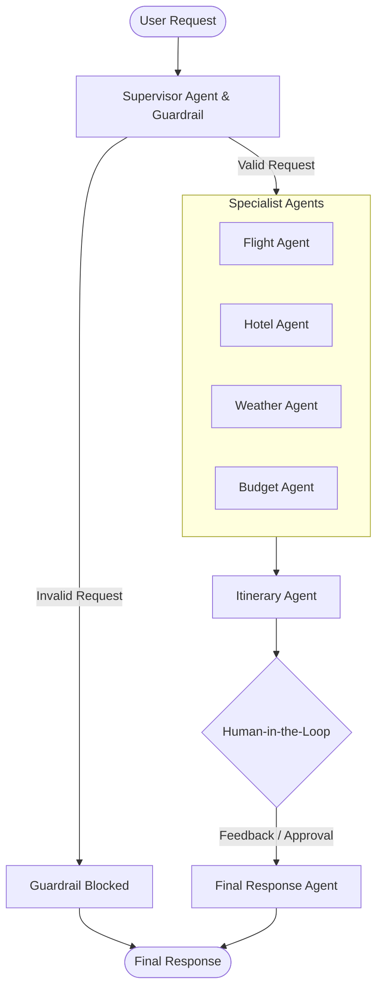

# TripMate AI

*Your intelligent, multi-agent co-pilot for stress-free, personalized travel planning.*

TripMate AI is a multi-agent travel planner powered by LangGraph. It utilizes a supervisor agent, input guardrails, and specialized sub-agents to create detailed, practical, and budget-aware travel itineraries. It features a Human-in-the-Loop (HITL) approval step to refine the draft before presenting a final polished plan.

## System Architecture

The application routes travel requests through a supervisor agent which determines the necessary specialists. Once the specialists gather information via external API integrations (using the Model Context Protocol), an itinerary agent consolidates the data into a draft for human review.



## Key Features

- **Multi-Agent Architecture**: Separate LLM agents handle specific aspects of travel planning (Flights, Hotels, Weather, Budget, and Itinerary assembly).
- **Supervisor & Guardrails**: Automatically blocks non-travel-related or harmful queries, and dynamically selects which specialist agents to involve based on the user's prompt.
- **Human-in-the-Loop (HITL)**: Pauses execution to allow users to review the draft itinerary and provide feedback before finalizing the response.
- **Model Context Protocol (MCP)**: Interfaces with specialized data providers:
  - `Tavily` for hotel and neighborhood search.
  - `AviationStack` for flight routes, airlines, and airports.
  - `OpenWeather` for real-time weather and forecasts.
- **FastAPI Frontend**: Provides a clean and responsive web interface to interact with the multi-agent backend.

## Prerequisites

- Python 3.10+
- PostgreSQL database (for LangGraph state persistence and checkpointing)
- `uv` and `uvx` (for running the AviationStack MCP server)

### Environment Variables

Create a `.env` file in the root directory with the following keys:

```ini
DATABASE_URL=your_postgresql_database_url
GROQ_API_KEY=your_groq_api_key
TAVILY_API_KEY=your_tavily_api_key
AVIATION_STACK_API_KEY=your_aviationstack_api_key
OPENWEATHER_API_KEY=your_openweather_api_key
```

## Running the Application

1. **Install dependencies:**
   ```bash
   pip install -r requirements.txt
   ```

2. **Start the FastAPI server:**
   ```bash
   python app.py
   ```
   *The server will start on `http://127.0.0.1:8000` with hot-reloading enabled.*

## API Endpoints

- `GET /` - Serves the web interface.
- `POST /api/travel` - Submits a new travel request.
- `POST /api/travel/approve` - Submits human approval or feedback for the drafted itinerary.
- `GET /health` - API health check.

---
**Made by Md Rashid Hayat Ansari**